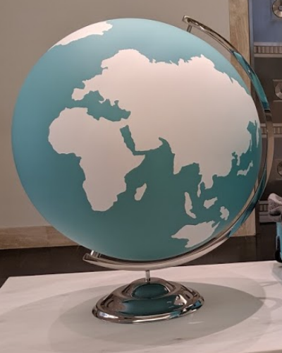

# globeprint

The other day, I was at Tiffany & Co. and I saw a globe that looked like this:

I decided I wanted one for myself, but I couldn't find one on the internet. My first idea was to take a regular globe, and glue some sheets of paper to its surface to turn it into a Tiffany blue globe. However, I quickly proved to myself that there is no way to map a plane to the surface of a sphere while preserving distances, and therefore sheets of paper do not cling tightly to a sphere. I still attempted to approximate the results using small strips of paper, as seen here:

However, this was messy and not very practical.

Now I'm experimenting with 3D printing. I sent a few spherical models to 3D printing services, where the continents are jutting out slightly on the sphere. This should make it possible to paint the oceans blue and the continents white. I also want to try 3D printing a hemispherical stencil, and using it to perfectly paint a totally flat sphere.
